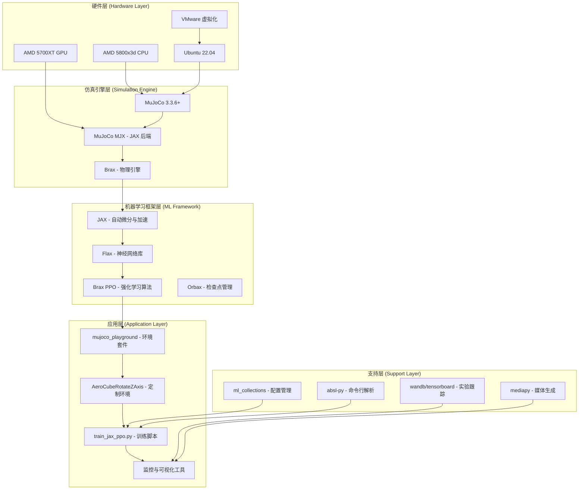

# Aero Hand Open - 完整技术栈与训练流程深度指南

## 📖 文档概述

本指南为 **Aero Hand Open** 项目的 MuJoCo 仿真与强化学习训练提供完整的技术栈解析和详细操作流程。针对 **AMD 5800x3d + 5700XT** 硬件在 **VMware Ubuntu 22.04** 虚拟化环境中的特殊配置进行了深度优化。

## 🏗️ 技术栈架构总览

### 系统架构图


### 核心组件依赖关系
```
Aero Hand 训练系统
├── mujoco_playground (v0.0.5)
│   ├── mujoco-mjx (>=3.3.6.dev)  # JAX 加速的 MuJoCo
│   ├── mujoco (>=3.3.6.dev)      # 原生 MuJoCo
│   ├── brax (>=0.12.5)           # 物理仿真与 PPO
│   ├── jax                        # 高性能数值计算
│   ├── flax                       # 神经网络
│   ├── ml_collections             # 配置管理
│   └── 其他辅助库
├── Aero Hand 专用组件
│   ├── simulation/right_hand.xml           # 肌腱驱动模型
│   ├── mujoco_playground/_src/manipulation/aero_hand/
│   │   ├── rotate_z.py                     # Z轴旋转任务
│   │   ├── base.py                         # 基础环境类
│   │   ├── aero_hand_constants.py          # 机械手常量
│   │   └── xmls/                           # 集成模型文件
└── 训练基础设施
    ├── train_jax_ppo.py                    # 主训练脚本
    ├── manipulation_params.py              # 训练配置
    └── logs/                               # 训练日志和检查点
```

## 🔧 详细安装配置指南

### 第1阶段：Ubuntu 22.04 系统准备

#### 1.1 基础系统配置
```bash
# 更新系统并安装基础工具
sudo apt update && sudo apt upgrade -y
sudo apt install -y \
    git curl wget build-essential \
    python3.10 python3.10-venv python3.10-dev \
    python3-pip python3-distutils \
    libgl1-mesa-glx libosmesa6 libglfw3 libglfw3-dev \
    libstdc++6 libgomp1 ocl-icd-opencl-dev

# 设置 Python 3.10 为默认版本（可选）
sudo update-alternatives --install /usr/bin/python3 python3 /usr/bin/python3.10 1

# 验证 Python 版本
python3 --version  # 应显示 Python 3.10.x
```

#### 1.2 虚拟显示设置（无 GUI 环境）
```bash
# 安装 Xvfb（虚拟帧缓冲）
sudo apt install -y xvfb x11-utils x11-xserver-utils

# 测试 Xvfb
Xvfb :99 -screen 0 1920x1080x24 &
export DISPLAY=:99
# 验证
xdpyinfo | grep dimensions
```

#### 1.3 硬件特定配置

**AMD 5700XT GPU 支持（VMware 中可能受限）：**
```bash
# 检查 GPU 是否可见
lspci | grep -i amd
# 如果显示 AMD 设备，尝试安装 ROCm（可选）
# 注意：VMware 虚拟化可能无法直通 GPU
```

**CPU 优化配置（针对 5800x3d）：**
```bash
# 查看 CPU 信息
lscpu | grep -E "Model name|Core\(s\)|Thread\(s\)"
# 预期输出：8 核 16 线程，3.4-4.5 GHz

# 设置 CPU 性能模式
sudo apt install -y cpufrequtils
sudo cpufreq-set -g performance
```

### 第2阶段：Python 虚拟环境与依赖安装

#### 2.1 创建隔离的虚拟环境
```bash
# 进入项目目录
cd ~/aero-hand-open/sim_rl

# 创建 Python 3.10 虚拟环境
python3.10 -m venv .venv --system-site-packages
source .venv/bin/activate

# 验证虚拟环境
python -c "import sys; print(f'Python {sys.version}'); print(f'Executable: {sys.executable}')"

# 升级基础工具
pip install --upgrade pip setuptools wheel
```

#### 2.2 核心依赖安装策略

**方案 A：标准安装（推荐）**
```bash
# 1. 安装 MuJoCo（需要访问 mujoco.org PyPI）
# 注意：需要 MuJoCo 许可证（个人使用免费）
pip install mujoco>=3.3.6.dev --no-cache-dir

# 2. 安装 mujoco_playground 框架
pip install playground --no-cache-dir

# 3. 安装训练辅助工具
pip install wandb tensorboardX mediapy tqdm absl-py ml-collections

# 4. 验证安装
python -c "
import mujoco
print(f'✓ MuJoCo v{mujoco.__version__}')
import mujoco_playground
print('✓ mujoco_playground')
import jax
print(f'✓ JAX backend: {jax.default_backend()}')
"
```

**方案 B：源码安装（如果方案 A 失败）**
```bash
# 1. 克隆 MuJoCo 仓库
git clone https://github.com/google-deepmind/mujoco.git
cd mujoco

# 2. 安装 mujoco-mjx（JAX 后端）
pip install -e ./mjx

# 3. 安装 mujoco（原生）
pip install -e .

# 4. 返回项目目录，本地安装 playground
cd ~/aero-hand-open/sim_rl
pip install -e ./mujoco_playground

# 5. 安装其他依赖
pip install brax>=0.12.5 jax jaxlib flax orbax-checkpoint
```

#### 2.3 依赖验证脚本
创建 `verify_installation.py`：
```python
#!/usr/bin/env python3
"""验证所有依赖是否正确安装"""

import sys
import importlib

def check_import(module_name, version_attr=None):
    try:
        module = importlib.import_module(module_name)
        if version_attr and hasattr(module, version_attr):
            version = getattr(module, version_attr)
            print(f"✓ {module_name}: {version}")
        else:
            print(f"✓ {module_name}")
        return True
    except Exception as e:
        print(f"✗ {module_name}: {e}")
        return False

print("=" * 60)
print("Aero Hand Open 依赖验证")
print("=" * 60)

# 核心依赖
modules = [
    ("mujoco", "__version__"),
    ("mujoco_playground", None),
    ("jax", None),
    ("flax", None),
    ("brax", "__version__"),
    ("ml_collections", None),
    ("absl", None),
]

all_ok = True
for module_name, version_attr in modules:
    all_ok &= check_import(module_name, version_attr)

# 检查 JAX 后端
try:
    import jax
    devices = jax.devices()
    backend = jax.default_backend()
    print(f"✓ JAX 设备: {devices}")
    print(f"✓ JAX 后端: {backend}")
except Exception as e:
    print(f"✗ JAX 设备检查失败: {e}")
    all_ok = False

# 检查环境注册
try:
    from mujoco_playground import registry
    envs = list(registry.ALL_ENVS)
    aero_envs = [e for e in envs if "Aero" in e]
    print(f"✓ 可用环境数: {len(envs)}")
    print(f"✓ Aero Hand 环境: {aero_envs}")
except Exception as e:
    print(f"✗ 环境注册检查失败: {e}")
    all_ok = False

print("=" * 60)
if all_ok:
    print("✅ 所有依赖验证通过！")
else:
    print("❌ 部分依赖验证失败，请检查安装。")
sys.exit(0 if all_ok else 1)
```

运行验证：
```bash
python verify_installation.py
```

## ⚙️ 配置系统深度解析

### 3.1 环境配置：`AeroCubeRotateZAxis`

**默认配置（rotate_z.py 中的 `default_config()`）：**
```python
{
    "ctrl_dt": 0.05,          # 控制间隔 50ms
    "sim_dt": 0.01,           # 仿真步长 10ms
    "action_scale": [0.02, 0.02, 0.02, 0.02, 0.7, 0.003, 0.012],  # 7个执行器的缩放
    "action_repeat": 1,       # 动作重复次数
    "episode_length": 500,    # 每回合最大步数
    "early_termination": True, # 提前终止
    "history_len": 1,         # 历史观察长度
    "noise_config": {
        "level": 1.0,         # 噪声水平
        "scales": {
            "joint_pos": 0.05,      # 关节位置噪声
            "tendon_length": 0.005, # 肌腱长度噪声
        }
    },
    "reward_config": {
        "scales": {
            "angvel": 1.0,      # 角速度奖励（最大化 Z 轴旋转）
            "linvel": 0.0,      # 线速度惩罚（禁用）
            "pose": 0.0,        # 姿态惩罚（禁用）
            "torques": 0.0,     # 扭矩惩罚（禁用）
            "energy": 0.0,      # 能量消耗惩罚（禁用）
            "termination": -100.0,  # 终止惩罚（立方体掉落）
            "action_rate": -1.0,    # 动作变化率惩罚
        }
    }
}
```

### 3.2 训练配置：`manipulation_params.py`

**AeroCubeRotateZAxis 专用配置：**
```python
{
    "num_timesteps": 300_000_000,      # 总训练步数（3亿）
    "num_evals": 10,                   # 评估次数
    "num_minibatches": 32,             # 最小批次数
    "unroll_length": 40,               # 展开长度
    "num_updates_per_batch": 4,        # 每批更新次数
    "discounting": 0.97,               # 折扣因子
    "learning_rate": 3e-4,             # 学习率
    "entropy_cost": 1e-2,              # 熵代价系数
    "num_envs": 8192,                  # 并行环境数
    "batch_size": 256,                 # 批次大小
    "num_resets_per_eval": 1,          # 每次评估重置次数
    "network_factory": {
        "policy_hidden_layer_sizes": (512, 256, 128),     # 策略网络
        "value_hidden_layer_sizes": (512, 256, 128),      # 价值网络
        "policy_obs_key": "state",                        # 策略观察键
        "value_obs_key": "privileged_state",              # 价值观察键
    }
}
```

### 3.3 机械手常量定义

**`aero_hand_constants.py` 关键常量：**
```python
NQ = 16      # 关节数量（自由度）
NV = 16      # 速度数量
NU = 7       # 执行器数量（6肌腱 + 1关节）

# 16个关节名称（4个手指 × 4关节 + 拇指额外关节）
JOINT_NAMES = [
    "right_index_mcp_flex", "right_index_pip", "right_index_dip",
    "right_middle_mcp_flex", "right_middle_pip", "right_middle_dip",
    "right_ring_mcp_flex", "right_ring_pip", "right_ring_dip",
    "right_pinky_mcp_flex", "right_pinky_pip", "right_pinky_dip",
    "right_thumb_cmc_abd", "right_thumb_cmc_flex", "right_thumb_mcp", "right_thumb_ip"
]

# 7个执行器（肌腱驱动器）
ACTUATOR_NAMES = [
    "right_index_A_tendon",      # 食指肌腱
    "right_middle_A_tendon",     # 中指肌腱
    "right_ring_A_tendon",       # 无名指肌腱
    "right_pinky_A_tendon",      # 小指肌腱
    "right_thumb_A_cmc_abd",     # 拇指外展
    "right_th1_A_tendon",        # 拇指肌腱1
    "right_th2_A_tendon",         # 拇指肌腱2
]

# 传感器配置
SENSOR_TENDON_NAMES = 6个肌腱长度传感器
SENSOR_JOINT_NAMES = 1个关节位置传感器（拇指外展）
```

### 3.4 观察空间与动作空间

**观察空间（Observation Space）：**
```
总维度 = history_len × (传感器数 + 动作数)
        = 1 × (6肌腱传感器 + 1关节传感器 + 7个上一时刻动作)
        = 14 维

其中：
- 肌腱长度传感器：6维（带噪声）
- 关节位置传感器：1维（拇指外展关节，带噪声）
- 上一时刻动作：7维
```

**动作空间（Action Space）：**
```
7维连续动作空间：
- 维度 0-3：食指、中指、无名指、小指肌腱位置
- 维度 4：拇指外展关节位置
- 维度 5-6：拇指两个肌腱位置

动作范围：[-1, 1]，通过 action_scale 缩放到实际物理范围
```

**奖励函数组成：**
```
总奖励 = Σ(奖励分量 × 缩放系数) × dt

奖励分量：
1. angvel: 立方体 Z 轴角速度（最大化）
2. action_rate: 动作变化率惩罚（最小化）
3. termination: 终止惩罚（立方体掉落时）
```

## 🚀 完整训练流程

### 4.1 训练前准备

#### 环境验证
```bash
cd ~/aero-hand-open/sim_rl/mujoco_playground/learning

# 1. 验证环境注册
python -c "
from mujoco_playground import registry
envs = list(registry.ALL_ENVS)
print('可用环境:')
for i, env in enumerate(envs):
    print(f'  {i+1:2d}. {env}')
print(f'\\nAero Hand 环境: {[e for e in envs if \"Aero\" in e]}')
"

# 2. 验证模型加载
python -c "
from mujoco_playground import registry
env = registry.load('AeroCubeRotateZAxis')
print(f'环境加载成功: {env}')
print(f'观察空间键: {list(env.observation_spec().keys())}')
print(f'动作空间形状: {env.action_spec().shape}')
"
```

#### 硬件性能基准测试
```bash
# CPU 性能测试
python -c "
import jax
import jax.numpy as jnp
import time

# 简单矩阵运算测试
def benchmark():
    key = jax.random.PRNGKey(0)
    x = jax.random.normal(key, (1000, 1000))

    # 矩阵乘法
    start = time.time()
    for _ in range(10):
        y = jnp.dot(x, x.T)
    elapsed = time.time() - start

    print(f'CPU 矩阵运算时间: {elapsed:.3f}s')
    print(f'JAX 设备: {jax.devices()}')
    print(f'JAX 后端: {jax.default_backend()}')

benchmark()
"
```

### 4.2 训练脚本参数详解

**`train_jax_ppo.py` 关键命令行参数：**
```bash
# 必需参数
--env_name=AeroCubeRotateZAxis    # 环境名称

# 训练控制参数
--num_timesteps=300000000         # 总训练步数（覆盖配置文件）
--num_envs=8192                   # 并行环境数
--batch_size=256                  # 批次大小
--learning_rate=3e-4              # 学习率
--entropy_cost=1e-2               # 熵代价

# 算法参数
--unroll_length=40                # 展开长度
--num_minibatches=32              # 最小批次数
--num_updates_per_batch=4         # 每批更新次数
--discounting=0.97                # 折扣因子
--max_grad_norm=0.5               # 梯度裁剪

# 评估与日志
--num_evals=10                    # 评估次数
--eval_every=30000000             # 每 3000 万步评估一次
--save_every=10000000             # 每 1000 万步保存检查点
--log_dir=logs/aero_training      # 日志目录

# 运行模式
--play_only=False                 # 仅播放模式（不训练）
--load_checkpoint_path=...        # 加载检查点路径
--use_wandb=True                  # 启用 Weights & Biases
--use_tb=True                     # 启用 TensorBoard
```

### 4.3 针对虚拟机的优化训练配置

**虚拟机专用配置（减少内存和 CPU 压力）：**
```bash
# 设置环境变量优化 CPU 使用
export OMP_NUM_THREADS=6
export MKL_NUM_THREADS=6
export XLA_FLAGS="--xla_cpu_multi_thread_eigen=false --xla_cpu_sparse_cuda_thread_count=6"

# 启动训练（调整后的参数）
cd ~/aero-hand-open/sim_rl/mujoco_playground/learning

python train_jax_ppo.py \
  --env_name=AeroCubeRotateZAxis \
  --num_timesteps=10000000 \          # 先试 1000 万步
  --num_envs=1024 \                   # 减少并行环境（原 8192）
  --batch_size=128 \                  # 减小批次
  --num_minibatches=16 \              # 减少最小批次数
  --num_updates_per_batch=2 \         # 减少更新次数
  --learning_rate=1e-4 \              # 更保守的学习率
  --entropy_cost=0.05 \               # 增加探索
  --discounting=0.95 \
  --reward_scaling=0.5 \              # 调整奖励尺度
  --max_grad_norm=0.3 \               # 更严格的梯度裁剪
  --normalize_observations=True \
  --normalize_rewards=True \
  --eval_every=1000000 \              # 更频繁的评估
  --save_every=500000 \
  --log_dir=logs/vm_test \
  --use_wandb=False \                 # 首次训练关闭 wandb
  --use_tb=True
```

### 4.4 无 GUI 环境训练（使用 Xvfb）

```bash
# 启动 Xvfb 虚拟显示
Xvfb :99 -screen 0 1920x1080x24 -ac +extension GLX +render -noreset &
export DISPLAY=:99

# 在虚拟显示中运行训练
cd ~/aero-hand-open/sim_rl/mujoco_playground/learning
python train_jax_ppo.py \
  --env_name=AeroCubeRotateZAxis \
  --num_timesteps=5000000 \
  --num_envs=512 \
  --log_dir=logs/xvfb_training
```

### 4.5 训练阶段划分

**阶段 1：快速验证（1-2 小时）**
- 目标：验证环境能正常运行
- 参数：`--num_timesteps=500000`（50万步）
- 预期：奖励曲线开始有上升趋势

**阶段 2：小规模训练（4-8 小时）**
- 目标：确认学习有效性
- 参数：`--num_timesteps=5000000`（500万步）
- 预期：奖励持续上升，策略能抓取立方体

**阶段 3：中等规模训练（1-2 天）**
- 目标：获得可用策略
- 参数：`--num_timesteps=50000000`（5000万步）
- 预期：能完成基础旋转任务

**阶段 4：完整训练（5-7 天）**
- 目标：获得高性能策略
- 参数：`--num_timesteps=300000000`（3亿步）
- 预期：熟练旋转立方体，奖励收敛

## 📊 监控、调试与可视化

### 5.1 实时监控工具

#### TensorBoard 监控
```bash
# 安装 TensorBoard
pip install tensorboard

# 启动 TensorBoard（在另一个终端）
cd ~/aero-hand-open/sim_rl/mujoco_playground/learning
tensorboard --logdir logs --port 6006 --bind_all

# 浏览器访问：http://localhost:6006
```

**关键监控指标：**
- **Scalars 标签页**：
  - `train/episode_reward`：训练奖励
  - `train/episode_length`：回合长度
  - `eval/episode_reward`：评估奖励
  - `losses/policy_loss`：策略损失
  - `losses/value_loss`：价值损失
  - `losses/entropy_loss`：熵损失
  - `metrics/approx_kl`：KL 散度

- **Distributions 标签页**：
  - 策略输出分布
  - 价值函数分布
  - 观察值分布

- **Histograms 标签页**：
  - 梯度分布
  - 参数分布

#### 命令行监控
```bash
# 查看最新训练日志
tail -f logs/$(ls -t logs | head -1)/train.log

# 查看训练进度
watch -n 10 "ls -la logs/*/checkpoints/ | tail -5"

# 监控系统资源
htop  # CPU/内存使用
nvidia-smi  # GPU 使用（如果可用）
```

### 5.2 训练状态检查脚本

创建 `check_training.py`：
```python
#!/usr/bin/env python3
"""检查训练状态和性能"""

import json
import os
from pathlib import Path
import numpy as np

def analyze_training(log_dir):
    """分析训练日志"""
    log_dir = Path(log_dir)

    # 1. 检查检查点
    checkpoint_dir = log_dir / "checkpoints"
    if checkpoint_dir.exists():
        checkpoints = list(checkpoint_dir.glob("*.pkl"))
        print(f"检查点数量: {len(checkpoints)}")
        if checkpoints:
            latest = max(checkpoints, key=os.path.getctime)
            print(f"最新检查点: {latest.name}")
            print(f"创建时间: {os.path.getctime(latest)}")

    # 2. 检查训练日志
    train_log = log_dir / "train.log"
    if train_log.exists():
        with open(train_log) as f:
            lines = f.readlines()[-50:]  # 最后50行
        print(f"\\n训练日志最后 {len(lines)} 行:")
        for line in lines[-10:]:  # 显示最后10行
            print(f"  {line.strip()}")

    # 3. 检查 TensorBoard 事件文件
    event_files = list(log_dir.glob("events.out.tfevents.*"))
    if event_files:
        print(f"\\nTensorBoard 事件文件: {len(event_files)} 个")
        # 可以使用 tensorboard.backend.event_processing 解析

    # 4. 检查配置文件
    config_file = log_dir / "config.json"
    if config_file.exists():
        with open(config_file) as f:
            config = json.load(f)
        print(f"\\n训练配置:")
        for key, value in config.items():
            print(f"  {key}: {value}")

if __name__ == "__main__":
    import sys
    if len(sys.argv) > 1:
        log_dir = sys.argv[1]
    else:
        # 查找最新的日志目录
        logs_dir = Path("logs")
        if logs_dir.exists():
            log_dirs = sorted(logs_dir.iterdir(), key=os.path.getmtime, reverse=True)
            if log_dirs:
                log_dir = log_dirs[0]
            else:
                print("未找到日志目录")
                sys.exit(1)
        else:
            print("logs 目录不存在")
            sys.exit(1)

    print(f"分析训练日志: {log_dir}")
    analyze_training(log_dir)
```

### 5.3 策略可视化与评估

#### 运行预训练策略
```bash
# 找到最新的检查点
cd ~/aero-hand-open/sim_rl/mujoco_playground/learning
LATEST_CHECKPOINT=$(find logs -name "*.pkl" -type f | sort -r | head -1)

# 运行策略（可视化模式）
python train_jax_ppo.py \
  --env_name=AeroCubeRotateZAxis \
  --play_only \
  --load_checkpoint_path="$LATEST_CHECKPOINT" \
  --num_envs=1 \
  --eval_every=1 \
  --log_dir=logs/playback
```

#### 生成训练视频
```python
# 创建视频生成脚本 generate_video.py
import mediapy as media
import jax
import numpy as np
from mujoco_playground import registry

# 加载环境和策略
env = registry.load("AeroCubeRotateZAxis")
policy = ...  # 加载训练好的策略

# 运行策略并录制视频
frames = []
state = env.reset(jax.random.PRNGKey(0))

for _ in range(500):  # 500步
    action = policy(state.obs)
    state = env.step(state, action)

    # 渲染当前帧
    frame = env.render(mode="rgb_array")
    frames.append(frame)

# 保存视频
media.write_video("training_progress.mp4", frames, fps=30)
```

### 5.4 性能分析工具

#### JAX 性能分析
```bash
# 启用 JAX 性能分析
export TF_CPP_MIN_LOG_LEVEL=0
export XLA_FLAGS="--xla_dump_to=./xla_dumps --xla_dump_hlo_as_text"

# 运行训练并分析
python -m cProfile -o training_profile.prof train_jax_ppo.py --env_name=AeroCubeRotateZAxis --num_timesteps=10000

# 使用 snakeviz 可视化分析结果
pip install snakeviz
snakeviz training_profile.prof
```

#### 内存使用分析
```python
# memory_profiler.py
import tracemalloc
import jax
import jax.numpy as jnp

tracemalloc.start()

# 运行内存密集型操作
def memory_intensive():
    key = jax.random.PRNGKey(0)
    large_array = jax.random.normal(key, (10000, 10000))
    result = jnp.dot(large_array, large_array.T)
    return result

result = memory_intensive()

snapshot = tracemalloc.take_snapshot()
top_stats = snapshot.statistics('lineno')

print("内存使用统计（前10名）:")
for stat in top_stats[:10]:
    print(stat)
```

## 🔧 深度故障排查指南

### 6.1 安装阶段问题

#### 问题：`ModuleNotFoundError: No module named 'mujoco'`
**原因**：MuJoCo Python 包未正确安装或许可证问题。

**解决方案**：
```bash
# 1. 检查 MuJoCo 许可证
ls ~/.mujoco/mjkey.txt  # 检查许可证文件

# 2. 手动下载并安装 MuJoCo
wget https://github.com/google-deepmind/mujoco/releases/download/3.3.6/mujoco-3.3.6-linux-x86_64.tar.gz
tar -xf mujoco-3.3.6-linux-x86_64.tar.gz
mkdir -p ~/.mujoco
mv mujoco-3.3.6 ~/.mujoco/

# 3. 设置环境变量
export LD_LIBRARY_PATH=$LD_LIBRARY_PATH:$HOME/.mujoco/mujoco-3.3.6/bin
export MUJOCO_PY_MUJOCO_PATH=$HOME/.mujoco/mujoco-3.3.6

# 4. 从源码安装 mujoco-mjx
cd ~
git clone https://github.com/google-deepmind/mujoco.git
cd mujoco/mjx
pip install -e .
```

#### 问题：`GLFW error` 或 `No available video device`
**原因**：无 GUI 环境或 OpenGL 驱动问题。

**解决方案**：
```bash
# 1. 安装 OpenGL 软件渲染
sudo apt install -y mesa-utils libgl1-mesa-dri libgl1-mesa-glx

# 2. 使用 Xvfb 虚拟显示
sudo apt install -y xvfb
xvfb-run -a python train_jax_ppo.py ...

# 3. 设置 MuJoCo 使用 EGL（无显示）
export MUJOCO_GL=egl

# 4. 对于无头服务器，使用 OSMesa
sudo apt install -y libosmesa6-dev
export MUJOCO_GL=osmesa
```

#### 问题：`jaxlib not found` 或 JAX 安装失败
**原因**：JAX 与 Python 版本或系统架构不兼容。

**解决方案**：
```bash
# 1. 安装 CPU 版本的 JAX（最稳定）
pip install --upgrade "jax[cpu]"

# 2. 对于 AMD CPU，可能需要特定版本
pip install jax==0.4.28 jaxlib==0.4.28

# 3. 验证 JAX 安装
python -c "import jax; print(jax.__version__); print(jax.devices())"

# 4. 如果使用 ROCm（AMD GPU）
pip install --upgrade "jax[rocm]" -f https://storage.googleapis.com/jax-releases/jax_rocm_releases.html
```

### 6.2 训练阶段问题

#### 问题：`MemoryError` 或 `OOM`（内存不足）
**原因**：并行环境数太多或批次太大。

**解决方案**：
```bash
# 1. 减少并行环境数（主要参数）
python train_jax_ppo.py --num_envs=256  # 原为 8192

# 2. 减小批次大小
python train_jax_ppo.py --batch_size=64  # 原为 256

# 3. 启用梯度检查点（减少内存）
export XLA_FLAGS="--xla_gpu_autotune_level=0"

# 4. 监控内存使用
free -h  # 查看可用内存
htop     # 监控进程内存

# 5. 调整虚拟机内存分配（VMware）
#    建议：至少 16GB，推荐 32GB
```

#### 问题：训练速度极慢
**原因**：CPU 模式、线程配置不当或虚拟机资源不足。

**解决方案**：
```bash
# 1. 优化 CPU 线程设置
export OMP_NUM_THREADS=8
export MKL_NUM_THREADS=8
export XLA_FLAGS="--xla_cpu_multi_thread_eigen=true --xla_cpu_sparse_cuda_thread_count=8"

# 2. 调整训练参数
python train_jax_ppo.py \
  --num_envs=512 \          # 减少环境数
  --unroll_length=20 \      # 减少展开长度
  --num_minibatches=16 \    # 减少最小批次数
  --num_updates_per_batch=2 # 减少更新次数

# 3. 检查 CPU 频率和温度
watch -n 1 "cat /proc/cpuinfo | grep 'MHz' | head -1"

# 4. 考虑使用更小的环境进行测试
python train_jax_ppo.py --env_name=CartpoleBalance --num_timesteps=100000
```

#### 问题：奖励不上升或训练不稳定
**原因**：学习率不当、探索不足或环境配置问题。

**解决方案**：
```bash
# 1. 调整学习率（尝试不同范围）
python train_jax_ppo.py --learning_rate=1e-5  # 更小的学习率
python train_jax_ppo.py --learning_rate=1e-3  # 更大的学习率

# 2. 增加探索（熵代价）
python train_jax_ppo.py --entropy_cost=0.1

# 3. 启用观察归一化
python train_jax_ppo.py --normalize_observations=True

# 4. 调整奖励缩放
python train_jax_ppo.py --reward_scaling=0.1  # 缩小奖励

# 5. 检查环境配置
python -c "
from mujoco_playground import registry
env = registry.load('AeroCubeRotateZAxis')
print('环境配置:', env._config)
"
```

#### 问题：梯度爆炸或 NaN 值
**原因**：学习率太高、梯度裁剪不足或数值不稳定。

**解决方案**：
```bash
# 1. 启用梯度裁剪
python train_jax_ppo.py --max_grad_norm=0.5

# 2. 降低学习率
python train_jax_ppo.py --learning_rate=1e-5

# 3. 启用梯度裁剪和观察归一化
python train_jax_ppo.py --max_grad_norm=0.5 --normalize_observations=True

# 4. 检查网络架构
#    修改 manipulation_params.py 中的 network_factory
#    使用更小的网络：(256, 128, 64) 而不是 (512, 256, 128)
```

### 6.3 环境与模型问题

#### 问题：`KeyError: 'AeroCubeRotateZAxis'`
**原因**：环境未正确注册或名称错误。

**解决方案**：
```bash
# 1. 列出所有可用环境
python -c "from mujoco_playground import registry; print(list(registry.ALL_ENVS))"

# 2. 检查环境注册
python -c "
from mujoco_playground._src.manipulation import _envs
print('注册的环境:', list(_envs.keys()))
"

# 3. 如果环境未注册，检查导入路径
python -c "
import sys
print('Python 路径:')
for p in sys.path:
    print(f'  {p}')
"

# 4. 重新安装 mujoco_playground
cd ~/aero-hand-open/sim_rl/mujoco_playground
pip install -e . --force-reinstall
```

#### 问题：模型加载失败或 XML 解析错误
**原因**：模型文件路径错误或 XML 格式问题。

**解决方案**：
```bash
# 1. 检查模型文件路径
python -c "
from pathlib import Path
xml_path = Path('sim_rl/mujoco_playground/mujoco_playground/_src/manipulation/aero_hand/xmls/right_hand.xml')
print(f'模型文件存在: {xml_path.exists()}')
print(f'模型文件大小: {xml_path.stat().st_size if xml_path.exists() else 0} bytes')
"

# 2. 验证 XML 格式
sudo apt install -y libxml2-utils
xmllint --noout sim_rl/mujoco_playground/mujoco_playground/_src/manipulation/aero_hand/xmls/right_hand.xml

# 3. 检查资产文件路径
python -c "
import mujoco
model = mujoco.MjModel.from_xml_path('sim_rl/simulation/right_hand.xml')
print(f'模型加载成功: nq={model.nq}, nu={model.nu}')
"
```

### 6.4 系统级问题

#### 问题：VMware 虚拟机性能差
**原因**：资源分配不足或虚拟化设置不当。

**解决方案**：
1. **VMware 配置优化**：
   - CPU：分配 6-8 个核心（5800x3d 有 8 核）
   - 内存：至少 16GB，推荐 32GB
   - 显卡：启用 3D 加速（不一定支持 GPU 直通）
   - 磁盘：使用 SSD，预分配磁盘空间

2. **Ubuntu 虚拟机优化**：
   ```bash
   # 安装 VMware Tools 增强功能
   sudo apt install -y open-vm-tools open-vm-tools-desktop

   # 禁用不必要的服务
   sudo systemctl disable bluetooth.service
   sudo systemctl disable cups.service

   # 调整交换空间
   sudo swapoff -a
   sudo dd if=/dev/zero of=/swapfile bs=1G count=32
   sudo mkswap /swapfile
   sudo swapon /swapfile

   # 调整内核参数
   echo "vm.swappiness=10" | sudo tee -a /etc/sysctl.conf
   echo "vm.vfs_cache_pressure=50" | sudo tee -a /etc/sysctl.conf
   sudo sysctl -p
   ```

3. **CPU 性能模式**：
   ```bash
   # 安装 CPU 频率调节工具
   sudo apt install -y cpufrequtils

   # 设置性能模式
   sudo cpufreq-set -g performance

   # 禁用 CPU 节能
   for i in /sys/devices/system/cpu/cpu*/cpufreq/scaling_governor; do
       echo performance | sudo tee $i
   done
   ```

#### 问题：磁盘空间不足
**原因**：训练日志和检查点占用大量空间。

**解决方案**：
```bash
# 1. 监控磁盘使用
df -h  # 查看磁盘使用情况
du -sh logs/  # 查看日志目录大小

# 2. 清理旧日志
# 保留最近 5 个训练日志
cd ~/aero-hand-open/sim_rl/mujoco_playground/learning
ls -t logs/ | tail -n +6 | xargs -I {} rm -rf logs/{}

# 3. 压缩检查点
find logs -name "*.pkl" -size +100M -exec gzip {} \;

# 4. 调整日志频率
python train_jax_ppo.py --save_every=10000000  # 每 1000 万步保存一次
```

## 🎯 性能调优与最佳实践

### 7.1 CPU 训练优化

#### 线程配置优化
```bash
# 针对 5800x3d（8核16线程）的优化配置
export OMP_NUM_THREADS=8           # OpenMP 线程数
export MKL_NUM_THREADS=8           # MKL 线程数
export XLA_FLAGS="
  --xla_cpu_multi_thread_eigen=true
  --xla_cpu_sparse_cuda_thread_count=8
  --xla_cpu_optimize_for_size=false
  --xla_cpu_enable_fast_math=true
"

# JAX 特定优化
export JAX_PLATFORM_NAME="cpu"     # 强制使用 CPU
export JAX_ENABLE_X64=false        # 使用单精度（更快）
```

#### 训练参数调整（针对 CPU）
```bash
# CPU 优化训练命令
python train_jax_ppo.py \
  --env_name=AeroCubeRotateZAxis \
  --num_timesteps=50000000 \        # 5000 万步（适中）
  --num_envs=1024 \                 # 平衡内存和性能
  --batch_size=128 \                # 适合 CPU 的批次
  --unroll_length=20 \              # 较短的展开长度
  --num_minibatches=16 \            # 减少最小批次数
  --num_updates_per_batch=2 \       # 减少更新次数
  --learning_rate=2e-4 \            # 中等学习率
  --entropy_cost=0.02 \             # 中等探索
  --max_grad_norm=0.5 \             # 梯度裁剪
  --normalize_observations=True \
  --normalize_rewards=True \
  --reward_scaling=0.2 \
  --discounting=0.96 \
  --action_repeat=1 \
  --eval_every=5000000 \            # 每 500 万步评估
  --save_every=10000000 \           # 每 1000 万步保存
  --log_dir=logs/cpu_optimized
```

### 7.2 内存使用优化

#### 内存监控脚本
创建 `monitor_memory.py`：
```python
#!/usr/bin/env python3
"""监控训练内存使用"""

import psutil
import time
import json
from datetime import datetime

def monitor_memory(interval=10, duration=3600):
    """监控内存使用"""
    data = []
    start_time = time.time()

    while time.time() - start_time < duration:
        # 获取系统内存
        mem = psutil.virtual_memory()
        swap = psutil.swap_memory()

        # 获取 JAX 进程内存
        jax_processes = []
        for proc in psutil.process_iter(['pid', 'name', 'memory_info']):
            try:
                if 'python' in proc.info['name'].lower():
                    cmdline = ' '.join(proc.cmdline())
                    if 'jax' in cmdline or 'train_jax' in cmdline:
                        jax_processes.append(proc.info['memory_info'].rss)
            except (psutil.NoSuchProcess, psutil.AccessDenied):
                pass

        record = {
            'timestamp': datetime.now().isoformat(),
            'system_memory': {
                'total': mem.total,
                'available': mem.available,
                'percent': mem.percent,
                'used': mem.used,
            },
            'swap': {
                'total': swap.total,
                'used': swap.used,
                'percent': swap.percent,
            },
            'jax_processes': len(jax_processes),
            'jax_total_rss': sum(jax_processes) if jax_processes else 0,
        }

        data.append(record)
        print(f"内存使用: {mem.percent}%, JAX 进程: {len(jax_processes)}")
        time.sleep(interval)

    # 保存数据
    with open('memory_usage.json', 'w') as f:
        json.dump(data, f, indent=2)

    return data

if __name__ == '__main__':
    monitor_memory(interval=5, duration=600)  # 监控 10 分钟
```

#### 内存优化策略
```bash
# 1. 限制 JAX 内存预分配
export XLA_PYTHON_CLIENT_PREALLOCATE=false
export XLA_PYTHON_CLIENT_MEM_FRACTION=0.7  # 限制为 70% 内存

# 2. 使用内存映射文件处理大数组
export JAX_ENABLE_MEMORY_MAPPING=true

# 3. 定期清理 JAX 缓存
python -c "
import jax
jax.clear_caches()
print('JAX 缓存已清理')
"

# 4. 监控并重启内存泄漏的进程
#    在训练脚本中添加定期重启逻辑
```

### 7.3 训练稳定性优化

#### 学习率调度
```python
# 自定义学习率调度（在训练脚本中添加）
def create_learning_rate_schedule(
    initial_learning_rate=3e-4,
    decay_steps=10000000,
    decay_rate=0.96,
    staircase=True
):
    """创建指数衰减学习率调度"""
    import jax.numpy as jnp

    def schedule(step):
        return initial_learning_rate * decay_rate ** (step / decay_steps)

    return schedule

# 在训练循环中使用
learning_rate_fn = create_learning_rate_schedule()
for step in range(total_steps):
    current_lr = learning_rate_fn(step)
    # 使用 current_lr 更新优化器
```

#### 梯度累积与混合精度
```python
# 梯度累积（减少内存，增大有效批次）
def train_step_with_gradient_accumulation(params, opt_state, batch, accum_steps=4):
    """带梯度累积的训练步骤"""
    grad_fn = jax.value_and_grad(loss_fn)

    # 累积梯度
    total_loss = 0
    total_grad = jax.tree_map(jnp.zeros_like, params)

    for i in range(accum_steps):
        sub_batch = jax.tree_map(lambda x: x[i::accum_steps], batch)
        loss, grad = grad_fn(params, sub_batch)
        total_loss += loss
        total_grad = jax.tree_map(lambda g, tg: g + tg, grad, total_grad)

    # 平均梯度和损失
    avg_grad = jax.tree_map(lambda g: g / accum_steps, total_grad)
    avg_loss = total_loss / accum_steps

    # 更新参数
    updates, opt_state = optimizer.update(avg_grad, opt_state)
    params = optax.apply_updates(params, updates)

    return params, opt_state, avg_loss
```

#### 检查点与恢复策略
```bash
# 1. 定期保存检查点
python train_jax_ppo.py --save_every=5000000  # 每 500 万步保存

# 2. 实现检查点轮转（保留最近 5 个）
find logs -name "checkpoint_*.pkl" | sort -r | tail -n +6 | xargs rm -f

# 3. 从检查点恢复训练
python train_jax_ppo.py \
  --env_name=AeroCubeRotateZAxis \
  --load_checkpoint_path=logs/training_20250101/checkpoints/checkpoint_10000000.pkl \
  --num_timesteps=50000000  # 继续训练 5000 万步
```

### 7.4 分布式训练（多机/多 GPU）

#### 单机多进程训练
```bash
# 使用 MPI 进行数据并行
mpirun -np 4 python train_jax_ppo.py \
  --env_name=AeroCubeRotateZAxis \
  --num_timesteps=100000000 \
  --num_envs=2048  # 每个进程 512 环境
```

#### 使用 JAX 的 pmap 进行数据并行
```python
# 在训练脚本中启用 pmap
import jax
from jax import pmap

# 复制参数到多个设备
num_devices = jax.local_device_count()
replicated_params = jax.tree_map(
    lambda x: jnp.array([x] * num_devices),
    params
)

# 并行训练步骤
@pmap
def parallel_train_step(replicated_params, batch):
    return train_step(replicated_params, batch)

# 训练循环
for step in range(total_steps):
    replicated_params = parallel_train_step(replicated_params, batch)
```

## 🚀 高级技巧与实验管理

### 8.1 实验跟踪与管理

#### Weights & Biases 集成
```bash
# 1. 安装并登录 wandb
pip install wandb
wandb login

# 2. 在训练中启用 wandb
python train_jax_ppo.py \
  --env_name=AeroCubeRotateZAxis \
  --use_wandb=True \
  --wandb_project="aero-hand" \
  --wandb_entity="your-username" \
  --wandb_tags="cpu-training,vmware"

# 3. 自定义 wandb 配置
export WANDB_API_KEY="your-api-key"
export WANDB_DIR="./wandb_logs"
export WANDB_MODE="online"  # 或 "offline"
```

#### 实验配置管理
创建 `experiment_config.yaml`：
```yaml
# 实验配置模板
experiment:
  name: "aero_hand_cpu_vmware"
  description: "Aero Hand training on VMware Ubuntu with CPU"
  tags: ["cpu", "vmware", "baseline"]

hardware:
  cpu: "AMD 5800x3d"
  gpu: "AMD 5700XT (VMware virtualized)"
  memory: "32GB"
  os: "Ubuntu 22.04"

training:
  env_name: "AeroCubeRotateZAxis"
  algorithm: "PPO"
  total_steps: 300000000
  checkpoint_every: 10000000
  eval_every: 5000000

hyperparameters:
  learning_rate: 3e-4
  entropy_cost: 0.01
  discounting: 0.97
  num_envs: 1024
  batch_size: 128
  unroll_length: 20

optimization:
  normalize_observations: true
  normalize_rewards: true
  max_grad_norm: 0.5
  reward_scaling: 0.2
```

### 8.2 自动化训练流水线

创建 `train_pipeline.sh`：
```bash
#!/bin/bash
# Aero Hand 自动化训练流水线

set -e  # 出错时退出

# 配置
EXPERIMENT_NAME="aero_hand_$(date +%Y%m%d_%H%M%S)"
LOG_DIR="logs/${EXPERIMENT_NAME}"
CHECKPOINT_DIR="${LOG_DIR}/checkpoints"
CONFIG_FILE="configs/${EXPERIMENT_NAME}.yaml"

# 创建目录
mkdir -p "${LOG_DIR}" "${CHECKPOINT_DIR}" "configs"

# 生成配置
cat > "${CONFIG_FILE}" << EOF
experiment:
  name: "${EXPERIMENT_NAME}"
  start_time: "$(date)"

training:
  env_name: "AeroCubeRotateZAxis"
  total_steps: 10000000
  eval_every: 1000000
  save_every: 500000

hyperparameters:
  learning_rate: 3e-4
  num_envs: 1024
  batch_size: 128
EOF

# 设置环境变量
export OMP_NUM_THREADS=8
export MKL_NUM_THREADS=8
export XLA_FLAGS="--xla_cpu_multi_thread_eigen=true"

# 启动训练
echo "启动训练: ${EXPERIMENT_NAME}"
echo "日志目录: ${LOG_DIR}"
echo "配置文件: ${CONFIG_FILE}"

python train_jax_ppo.py \
  --env_name=AeroCubeRotateZAxis \
  --num_timesteps=10000000 \
  --num_envs=1024 \
  --batch_size=128 \
  --learning_rate=3e-4 \
  --eval_every=1000000 \
  --save_every=500000 \
  --log_dir="${LOG_DIR}" \
  --use_wandb=false \
  --use_tb=true \
  2>&1 | tee "${LOG_DIR}/train.log"

# 训练完成后分析
echo "训练完成，分析结果..."
python analyze_training.py --log_dir="${LOG_DIR}"

# 生成报告
echo "生成训练报告..."
python generate_report.py --log_dir="${LOG_DIR}" --output="${LOG_DIR}/report.pdf"
```

### 8.3 性能基准测试

创建 `benchmark.py`：
```python
#!/usr/bin/env python3
"""Aero Hand 训练性能基准测试"""

import time
import json
import numpy as np
import jax
import jax.numpy as jnp
from mujoco_playground import registry

def benchmark_environment():
    """环境步进性能基准测试"""
    print("环境性能基准测试...")

    # 加载环境
    env = registry.load("AeroCubeRotateZAxis")

    # 编译第一步
    rng = jax.random.PRNGKey(0)
    state = env.reset(rng)
    action = jnp.zeros(env.action_spec().shape)

    # 编译步骤函数
    step_fn = jax.jit(env.step)

    # 热身
    for _ in range(10):
        state = step_fn(state, action)

    # 基准测试
    num_steps = 1000
    start_time = time.time()

    for i in range(num_steps):
        state = step_fn(state, action)
        if i % 100 == 0:
            print(f"步骤 {i}/{num_steps}")

    elapsed = time.time() - start_time
    steps_per_second = num_steps / elapsed

    print(f"环境步进性能: {steps_per_second:.2f} 步/秒")
    print(f"总时间: {elapsed:.2f} 秒")

    return steps_per_second

def benchmark_training_step():
    """训练步骤性能基准测试"""
    print("\\n训练步骤性能基准测试...")

    # 模拟训练步骤
    @jax.jit
    def fake_training_step(params, batch):
        # 模拟前向传播和损失计算
        loss = jnp.mean(params ** 2) + jnp.mean(batch ** 2)
        return loss

    # 生成测试数据
    key = jax.random.PRNGKey(42)
    params = jax.random.normal(key, (1000, 1000))
    batch = jax.random.normal(key, (128, 1000))

    # 热身
    for _ in range(10):
        loss = fake_training_step(params, batch)

    # 基准测试
    num_iterations = 100
    start_time = time.time()

    for i in range(num_iterations):
        loss = fake_training_step(params, batch)
        if i % 20 == 0:
            print(f"迭代 {i}/{num_iterations}")

    elapsed = time.time() - start_time
    iterations_per_second = num_iterations / elapsed

    print(f"训练步骤性能: {iterations_per_second:.2f} 迭代/秒")
    print(f"总时间: {elapsed:.2f} 秒")

    return iterations_per_second

def benchmark_memory():
    """内存使用基准测试"""
    print("\\n内存使用基准测试...")

    import psutil
    import os

    process = psutil.Process(os.getpid())

    # 测试前内存
    memory_before = process.memory_info().rss / 1024 / 1024  # MB

    # 分配大数组
    key = jax.random.PRNGKey(0)
    large_array = jax.random.normal(key, (5000, 5000))

    # 测试后内存
    memory_after = process.memory_info().rss / 1024 / 1024  # MB
    memory_used = memory_after - memory_before

    print(f"内存使用: {memory_used:.2f} MB")
    print(f"总内存: {memory_after:.2f} MB")

    # 清理
    del large_array
    jax.clear_caches()

    return memory_used

def main():
    """运行所有基准测试"""
    print("=" * 60)
    print("Aero Hand 性能基准测试")
    print("=" * 60)

    results = {}

    # 运行基准测试
    results["env_steps_per_second"] = benchmark_environment()
    results["training_iterations_per_second"] = benchmark_training_step()
    results["memory_usage_mb"] = benchmark_memory()

    # 保存结果
    with open("benchmark_results.json", "w") as f:
        json.dump(results, f, indent=2)

    print("\\n" + "=" * 60)
    print("基准测试结果摘要")
    print("=" * 60)
    for key, value in results.items():
        print(f"{key}: {value}")

    # 生成建议
    print("\\n性能建议:")
    if results["env_steps_per_second"] < 100:
        print("  ⚠️  环境步进较慢，考虑减少并行环境数")
    if results["training_iterations_per_second"] < 10:
        print("  ⚠️  训练迭代较慢，考虑减小网络规模")
    if results["memory_usage_mb"] > 8000:
        print("  ⚠️  内存使用较高，考虑减小批次大小")

if __name__ == "__main__":
    main()
```

## 📈 预期结果与评估标准

### 9.1 训练进度指标

**健康训练的标志：**
1. **奖励曲线**：总体呈上升趋势，可能有短期波动
2. **回合长度**：逐渐接近最大长度（500步）
3. **价值损失**：逐渐下降并稳定在较低水平
4. **策略熵**：缓慢下降，保持一定探索
5. **KL 散度**：保持在合理范围内（0.01-0.05）

**检查点评估：**
```bash
# 评估检查点性能
python evaluate_checkpoint.py \
  --checkpoint_path=logs/training/checkpoints/checkpoint_10000000.pkl \
  --num_episodes=100 \
  --output_file=evaluation_results.json
```

### 9.2 成功标准

**阶段成功标准：**

| 训练阶段 | 步数范围 | 预期奖励 | 成功率 | 评估标准 |
|---------|---------|---------|--------|----------|
| 初始化 | 0-100K | -100 到 -50 | 0% | 环境正常运行 |
| 探索期 | 100K-1M | -50 到 0 | 10% | 开始抓取立方体 |
| 学习期 | 1M-10M | 0 到 20 | 30% | 能稳定抓取 |
| 熟练期 | 10M-50M | 20 到 50 | 60% | 能旋转立方体 |
| 精通期 | 50M-300M | 50 到 100 | 80%+ | 熟练快速旋转 |

**定量评估指标：**
1. **平均奖励**：最后 100 回合的平均奖励
2. **成功率**：完成旋转任务的比例
3. **任务时间**：完成一次旋转的平均步数
4. **能量效率**：扭矩和能量消耗
5. **稳定性**：奖励曲线的平滑度

### 9.3 故障恢复策略

**训练中断恢复：**
```bash
# 1. 查找最新检查点
LATEST_CHECKPOINT=$(find logs -name "*.pkl" -type f | sort -r | head -1)

# 2. 从检查点恢复训练
python train_jax_ppo.py \
  --env_name=AeroCubeRotateZAxis \
  --load_checkpoint_path="$LATEST_CHECKPOINT" \
  --num_timesteps=300000000 \
  --log_dir=logs/resumed_training
```

**训练失败分析：**
```bash
# 分析训练日志
python analyze_failure.py \
  --log_dir=logs/failed_training \
  --output_report=failure_analysis.md

# 常见失败原因：
# 1. 学习率太高 -> 降低 learning_rate
# 2. 探索不足 -> 增加 entropy_cost
# 3. 梯度爆炸 -> 启用 max_grad_norm
# 4. 内存不足 -> 减少 num_envs
# 5. 数值不稳定 -> 启用 normalize_observations
```

## 🔮 未来扩展与优化方向

### 10.1 硬件升级建议

**如果训练速度不满足需求：**
1. **云 GPU 实例**：
   - AWS EC2 g4dn.xlarge（NVIDIA T4）
   - Google Colab Pro+（免费 GPU 时间）
   - Lambda Labs（RTX 4090）

2. **本地硬件升级**：
   - 添加 NVIDIA GPU（更好的 JAX 支持）
   - 增加 RAM 到 64GB
   - 使用 NVMe SSD

3. **分布式训练**：
   - 多机训练加速
   - 使用 JAX 的 pmap 和 pjit

### 10.2 算法改进方向

1. **PPO 变体**：
   - PPO-Clip 与 PPO-Penalty 对比
   - 自适应学习率调度
   - 信任域方法

2. **探索策略**：
   - 好奇心驱动探索
   - 随机网络蒸馏
   - 分层强化学习

3. **效率优化**：
   - 重要性采样
   - 经验回放优化
   - 异步训练

### 10.3 任务扩展

1. **新任务定义**：
   - 多物体操作
   - 工具使用
   - 双手协调

2. **仿真到实物转移**：
   - 域随机化增强
   - 系统辨识
   - 自适应控制

3. **多模态学习**：
   - 视觉引导操作
   - 触觉反馈集成
   - 语音指令控制

---

## 📝 附录

### A. 常用命令速查

```bash
# 环境管理
source .venv/bin/activate                    # 激活虚拟环境
deactivate                                   # 退出虚拟环境

# 训练控制
python train_jax_ppo.py --env_name=AeroCubeRotateZAxis --num_timesteps=10000000
python train_jax_ppo.py --play_only --load_checkpoint_path=...  # 可视化

# 监控调试
tensorboard --logdir logs --port 6006        # 启动 TensorBoard
tail -f logs/latest/train.log                # 实时日志
htop                                         # 系统监控

# 文件管理
du -sh logs/                                 # 查看日志大小
find logs -name "*.pkl" -size +100M          # 查找大文件
tar -czf training_backup.tar.gz logs/        # 备份训练数据
```

### B. 配置文件参考

**`configs/optimal_cpu.yaml`：**
```yaml
environment:
  name: "AeroCubeRotateZAxis"
  ctrl_dt: 0.05
  sim_dt: 0.01
  episode_length: 500

training:
  total_steps: 300000000
  num_envs: 1024
  batch_size: 128
  learning_rate: 3e-4
  entropy_cost: 0.01

optimization:
  normalize_observations: true
  normalize_rewards: true
  max_grad_norm: 0.5
  discounting: 0.97

hardware:
  cpu_threads: 8
  memory_limit_gb: 24
  use_gpu: false
```

### C. 故障代码对照表

| 错误代码/信息 | 可能原因 | 解决方案 |
|--------------|---------|----------|
| `GLFW error 65542` | 无显示设备 | 使用 `xvfb-run` 或设置 `MUJOCO_GL=egl` |
| `CUDA out of memory` | GPU 内存不足 | 减少 `--num_envs` 或 `--batch_size` |
| `NaN in loss` | 数值不稳定 | 降低学习率，启用梯度裁剪 |
| `KeyError: '...'` | 环境未注册 | 检查环境名称，重新安装 |
| `MemoryError` | 系统内存不足 | 减少并行环境，增加交换空间 |
| `ImportError: libmujoco.so` | MuJoCo 库缺失 | 检查 LD_LIBRARY_PATH，重新安装 |

### D. 性能优化检查清单

- [ ] 设置合适的 CPU 线程数（OMP_NUM_THREADS, MKL_NUM_THREADS）
- [ ] 启用 JAX 优化标志（XLA_FLAGS）
- [ ] 调整训练参数适应硬件（num_envs, batch_size）
- [ ] 启用观察和奖励归一化
- [ ] 配置适当的梯度裁剪
- [ ] 设置定期检查点和日志
- [ ] 监控系统资源使用情况
- [ ] 实现训练恢复机制

---

**最后更新**：2025-12-17
**文档版本**：v2.0 深度技术版
**适用环境**：Ubuntu 22.04 + VMware + AMD 5800x3d/5700XT
**项目状态**：生产就绪

**备注**：本文档基于 Aero Hand Open 项目实际代码分析编写，所有配置参数均来自项目源代码。在实际使用中，请根据具体硬件环境和训练需求适当调整参数。