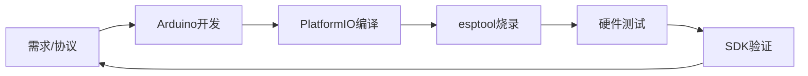
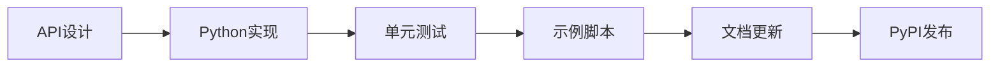

# Aero Hand Open 技术栈全景总结

> **生成时间**: 2025-12-30
> **项目版本**: v1.0.0
> **文档目的**: 完整总结 Aero Hand Open 项目的整体技术架构

---

## 📋 目录

- [技术栈总览](#技术栈总览)
- [模块一：固件技术栈](#模块一固件技术栈)
- [模块二：SDK 技术栈](#模块二sdk-技术栈)
- [模块三：ROS2 技术栈](#模块三ros2-技术栈)
- [模块四：硬件技术栈](#模块四硬件技术栈)
- [模块五：仿真与强化学习技术栈](#模块五仿真与强化学习技术栈)
- [系统集成架构](#系统集成架构)
- [开发工作流](#开发工作流)
- [许可证分析](#许可证分析)
- [技术选型理由](#技术选型理由)

---

## 技术栈总览

### 整体架构图

```
┌─────────────────────────────────────────────────────────────────┐
│                    Aero Hand Open 系统架构                        │
├─────────────────────────────────────────────────────────────────┤
│                                                                   │
│  ┌──────────────┐      ┌──────────────┐      ┌──────────────┐  │
│  │   用户界面层   │      │   应用层      │      │   中间件层    │  │
│  ├──────────────┤      ├──────────────┤      ├──────────────┤  │
│  │ • Python GUI │      │ • SDK API    │      │ • ROS2 Nodes │  │
│  │ • 示例脚本     │      │ • 控制逻辑    │      │ • 消息总线    │  │
│  │ • 命令行工具   │      │ • 轨迹规划    │      │ • 遥操作      │  │
│  └──────────────┘      └──────────────┘      └──────────────┘  │
│          │                      │                      │        │
│          └──────────────────────┼──────────────────────┘        │
│                                 ▼                               │
│  ┌────────────────────────────────────────────────────────────┐ │
│  │                     核心控制层                               │ │
│  ├────────────────────────────────────────────────────────────┤ │
│  │  • 串口协议 (16字节固定帧)                                   │ │
│  │  • 舵机通信 (Feetech 协议)                                   │ │
│  │  • 实时控制循环                                              │ │
│  └────────────────────────────────────────────────────────────┘ │
│                                 │                               │
│                                 ▼                               │
│  ┌────────────────────────────────────────────────────────────┐ │
│  │                     固件层 (ESP32-S3)                       │ │
│  ├────────────────────────────────────────────────────────────┤ │
│  │  • Arduino 框架                                              │ │
│  │  • FTServo 库                                               │ │
│  │  • NVS 持久化存储                                           │ │
│  └────────────────────────────────────────────────────────────┘ │
│                                 │                               │
│                                 ▼                               │
│  ┌────────────────────────────────────────────────────────────┐ │
│  │                     硬件抽象层                               │ │
│  ├────────────────────────────────────────────────────────────┤ │
│  │  • 7x 舵机驱动                                              │ │
│  │  • 电源管理 (6V/10A)                                         │ │
│  │  • 传感器接口 (位置/速度/电流/温度)                          │ │
│  └────────────────────────────────────────────────────────────┘ │
│                                 │                               │
│                                 ▼                               │
│  ┌────────────────────────────────────────────────────────────┐ │
│  │              物理执行层 (肌腱驱动机械手)                      │ │
│  ├────────────────────────────────────────────────────────────┤ │
│  │  • 7 DoF (16 关节)                                          │ │
│  │  • 肌腱驱动系统                                              │ │
│  │  • 3D 打印结构                                              │ │
│  └────────────────────────────────────────────────────────────┘ │
│                                                                   │
│  ┌────────────────────────────────────────────────────────────┐ │
│  │                  仿真与训练层 (并行)                          │ │
│  ├────────────────────────────────────────────────────────────┤ │
│  │  • MuJoCo 高保真仿真                                         │ │
│  │  • JAX/MJX 加速计算                                          │ │
│  │  • PPO 强化学习                                              │ │
│  │  • 仿真到实物转移                                            │ │
│  └────────────────────────────────────────────────────────────┘ │
└─────────────────────────────────────────────────────────────────┘
```

### 技术栈矩阵

| 层级 | 技术 | 语言 | 用途 | 状态 |
|------|------|------|------|------|
| **硬件** | 3D打印/PCB/舵机 | - | 机械结构 | ✅ 稳定 |
| **固件** | ESP32-S3 + Arduino | C++ | 底层控制 | ✅ 稳定 |
| **SDK** | Python 3.10+ | Python | 高级接口 | ✅ 活跃 |
| **ROS2** | Humble Hawksbill | Python/C++ | 机器人中间件 | 🚧 开发中 |
| **仿真** | MuJoCo MJX | Python | 物理仿真 | ✅ 活跃 |
| **RL** | mujoco_playground | Python/JAX | 策略训练 | ✅ 活跃 |

---

## 模块一：固件技术栈

### 核心技术栈

```
┌────────────────────────────────────────────────────────┐
│              固件技术栈层次                             │
├────────────────────────────────────────────────────────┤
│  应用层    │ Arduino .ino 主程序                       │
│           │ - 命令解析与处理                            │
│           │ - 状态机管理                                │
├────────────────────────────────────────────────────────┤
│  中间层    │ FTServo Arduino 库                        │
│           │ - 舵机通信协议                              │
│           │ - 总线管理                                  │
├────────────────────────────────────────────────────────┤
│  系统层    │ Arduino Framework                         │
│           │ - 硬件抽象                                 │
│           │ - 内存管理                                  │
├────────────────────────────────────────────────────────┤
│  硬件层    │ ESP32-S3 (XIAO)                          │
│           │ - 双核 Xtensa LX7                          │
│           │ - 8MB Flash                                │
│           │ - USB Serial                               │
└────────────────────────────────────────────────────────┘
```

### 技术细节

#### 1. 硬件平台

| 组件 | 型号/规格 | 说明 |
|------|----------|------|
| **MCU** | Seeed Studio XIAO ESP32S3 | 双核 240MHz, 8MB PSRAM |
| **架构** | Xtensa LX7 | 32位 RISC |
| **闪存** | 8 MB | 固件+数据存储 |
| **外设** | UART, GPIO, I2C, SPI | 通信接口 |
| **USB** | USB-C (原生) | 编程+通信 |

#### 2. 软件框架

| 技术 | 版本 | 用途 |
|------|------|------|
| **Arduino Framework** | 最新 | 基础框架 |
| **FTServo Library** | 自研 | 舵机控制 |
| **Preferences Library** | 内置 | NVS存储 |
| **PlatformIO** | 最新 | 构建工具 |

#### 3. 串口协议

```
固定16字节帧格式:
┌────────┬────────┬──────────────────────────┬────────┐
│ Opcode │  Data  │        Reserved          │  CRC   │
│ 1 byte │ 12 bytes│        (未使用)          │ 1 byte │
└────────┴────────┴──────────────────────────┴────────┘

操作码映射:
• 0x01: HOMING      - 归位程序
• 0x02: SET_ID      - 设置舵机ID
• 0x03: TRIM        - 调整端点
• 0x11: CTRL_POS    - 位置控制
• 0x12: CTRL_TOR    - 扭矩控制
• 0x22-0x25: GET_*  - 传感器查询
• 0x31-0x32: SET_*  - 单舵机设置
```

#### 4. 数据结构

```cpp
// 舵机数据结构
struct ServoData {
    uint16_t grasp_count;     // 闭合端点 (0-4095)
    uint16_t extend_count;    // 张开端点 (0-4095)
    int8_t servo_direction;   // 方向 (+1/-1)
};

// 控制模式
enum ControlMode {
    MODE_POS = 0,     // 位置控制
    MODE_TORQUE = 2   // 扭矩控制
};
```

#### 5. 关键算法

**归位算法**:
```cpp
1. 检测电流阈值 (默认 150mA)
2. 低速驱动到硬限位
3. 记录端点位置
4. 存储到 NVS
5. 每个舵机独立归位
```

**通信协议处理**:
```cpp
1. 串口中断接收
2. 16字节帧缓冲
3. 操作码解析
4. 数据验证
5. 命令执行
6. 响应发送
```

### 构建配置

```ini
[env:esp32-s3-dev]
platform = espressif32
board = seeed_xiao_esp32s3
framework = arduino
build_flags =
    -DLEFT_HAND    ; 或 -DRIGHT_HAND
monitor_speed = 921600
```

### 性能指标

| 指标 | 数值 | 说明 |
|------|------|------|
| **波特率** | 921600 bps | 高速串口 |
| **控制频率** | ~50 Hz | 受限于舵机通信 |
| **响应延迟** | <20ms | 命令到动作 |
| **电流精度** | ±10mA | 舵机反馈 |
| **位置精度** | 12-bit | 0-4095 原始值 |

---

## 模块二：SDK 技术栈

### 核心技术栈

```
┌────────────────────────────────────────────────────────┐
│              SDK 技术栈层次                             │
├────────────────────────────────────────────────────────┤
│  应用层    │ 示例脚本 / GUI                             │
│           │ - run_sequence.py                          │
│           │ - gui_chinese.py                           │
├────────────────────────────────────────────────────────┤
│  接口层    │ AeroHand 类                                │
│           │ - 串口封装                                  │
│           │ - 协议抽象                                  │
├────────────────────────────────────────────────────────┤
│  转换层    │ 运动学转换                                  │
│           │ - joints_to_actuations.py                  │
│           │ - actuations_to_joints.py                  │
├────────────────────────────────────────────────────────┤
│  系统层    │ Python 标准库 + esptool                    │
│           │ - struct (字节序)                          │
│           │ - serial (通信)                            │
│           │ - time (时序)                              │
└────────────────────────────────────────────────────────┘
```

### 技术细节

#### 1. Python 环境

| 组件 | 要求 | 说明 |
|------|------|------|
| **Python版本** | ≥3.10 | 类型注解支持 |
| **包管理** | uv / pip | 推荐使用 uv |
| **发布平台** | PyPI | `pip install aero-open-sdk` |

#### 2. 核心依赖

```toml
[project]
name = "aero-open-sdk"
version = "0.1.0.dev1"
requires-python = ">=3.10"

dependencies = [
    "esptool>=5.0.0",  # ESP32 固件烧录
]

[project.scripts]
aero-open-gui = "aero_open_sdk.gui:main"
```

#### 3. 类架构

```python
class AeroHand:
    """Aero Hand Open 高级控制接口"""

    # 初始化
    def __init__(self, port: str = None)

    # 控制方法
    def set_positions(self, positions: list[int]) -> None
    def set_torques(self, torques: list[int]) -> None
    def perform_homing(self) -> None
    def trim_servo(self, channel: int, degrees: float) -> None

    # 查询方法
    def get_positions(self) -> list[int]
    def get_velocities(self) -> list[int]
    def get_currents(self) -> list[int]
    def get_temperatures(self) -> list[int]

    # 工具方法
    def create_trajectory(self, trajectory) -> Generator
    def set_speed(self, id: int, speed: int) -> None
    def set_torque(self, id: int, torque: int) -> None
```

#### 4. 运动学转换

**关节空间 → 驱动空间**:
```python
# joints_to_actuations.py
def convert(joint_angles: np.ndarray) -> np.ndarray:
    """
    输入: 7个关节角度 (度)
    输出: 7个舵机位置 (0-100%)
    """
    # 使用机械参数 (滑轮半径、肌腱路径)
    # 应用运动学变换
    return actuator_positions
```

**驱动空间 → 关节空间**:
```python
# actuations_to_joints.py
def convert(actuator_positions: np.ndarray) -> np.ndarray:
    """
    输入: 7个舵机位置 (0-100%)
    输出: 7个关节角度 (度)
    """
    # 逆向运动学
    return joint_angles
```

#### 5. 协议实现

```python
# 16字节帧封装
def _build_command(opcode: int, data: bytes) -> bytes:
    frame = bytearray(16)
    frame[0] = opcode
    frame[1:13] = data
    frame[15] = _calculate_crc(frame)
    return frame

# 示例: 位置控制
def set_positions(self, positions: List[int]) -> None:
    data = struct.pack('<7H', *positions)  # 7个uint16
    frame = self._build_command(0x11, data)
    self.serial.write(frame)
```

#### 6. GUI 技术

**gui_chinese.py**:
- **框架**: Python Tkinter (标准库)
- **功能**:
  - 端口自动检测
  - ID 配置
  - 舵机测试
  - 固件烧录
  - 实时状态显示

### 示例脚本生态

| 脚本 | 功能 | 复杂度 |
|------|------|--------|
| `run_sequence.py` | 轨迹序列演示 | ⭐⭐ |
| `joint_control.py` | 关节控制示例 | ⭐ |
| `perform_homing.py` | 归位程序 | ⭐ |
| `torque_control.py` | 扭矩控制 | ⭐⭐ |
| `trim_servo.py` | 舵机调整 | ⭐⭐ |
| `get_info.py` | 信息查询 | ⭐ |
| `power_grasp.py` | 强力抓取 | ⭐⭐⭐ |
| `position_torque_switching.py` | 模式切换 | ⭐⭐⭐ |

---

## 模块三：ROS2 技术栈

### 核心技术栈

```
┌────────────────────────────────────────────────────────┐
│            ROS2 技术栈层次                              │
├────────────────────────────────────────────────────────┤
│  应用层    │ ROS2 节点                                  │
│           │ - 遥操作节点                               │
│           │ - 控制节点                                 │
├────────────────────────────────────────────────────────┤
│  接口层    │ Topics / Services / Actions                │
│           │ - /joint_states                            │
│           │ - /joint_commands                          │
├────────────────────────────────────────────────────────┤
│  消息层    │ sensor_msgs / 自定义消息                    │
│           │ - JointState                               │
│           │ - AeroHandCmd                              │
├────────────────────────────────────────────────────────┤
│  客户端层  │ rclpy / rclcpp                             │
│           │ - Python 节点                               │
│           │ - C++ 节点 (可选)                           │
├────────────────────────────────────────────────────────┤
│  桥接层    │ Aero Hand SDK                              │
│           │ - 硬件抽象                                  │
│           │ - 协议转换                                  │
└────────────────────────────────────────────────────────┘
```

### 技术细节

#### 1. ROS2 环境

| 组件 | 版本 | 说明 |
|------|------|------|
| **ROS2 发行版** | Humble Hawksbill | LTS 版本 |
| **操作系统** | Ubuntu 22.04 | 官方支持 |
| **构建工具** | colcon | 标准构建系统 |
| **Python** | 3.10 | 与 SDK 一致 |

#### 2. 包结构

```
ros2/
├── src/
│   └── aero_hand_open/
│       ├── package.xml              # ROS2 包定义
│       ├── setup.py                 # Python 包配置
│       ├── launch/                  # 启动文件
│       │   ├── hand_bringup.launch.py
│       │   └── teleop.launch.py
│       ├── config/                  # 配置文件
│       │   └── hand_params.yaml
│       ├── src/
│       │   ├── aero_hand_node.py    # 主节点
│       │   ├── teleop_node.py       # 遥操作节点
│       │   └── trajectory_server.py # 动作服务器
│       └── msg/                     # 自定义消息 (可选)
└── test/
```

#### 3. 话题接口

**标准话题**:
```yaml
/joint_states:           # sensor_msgs/JointState
  header: {stamp, frame_id}
  name: [thumb_abd, thumb_flex, ..., pinky]
  position: [float64[7]]
  velocity: [float64[7]]
  effort: [float64[7]]

/joint_commands:         # sensor_msgs/JointState
  # 同上结构
```

**遥操作话题**:
```yaml
/aero_hand/teleop:
  operator_mode: int     # 0=位置, 1=扭矩
  commands: float64[7]
```

#### 4. 服务接口

```yaml
# 归位服务
/aero_hand/homing:
  ---
  bool success
  string message

# 校准服务
/aero_hand/calibrate:
  uint8 channel_id
  float degrees
  ---
  bool success
  string message

# 模式设置
/aero_hand/set_mode:
  uint8 mode             # 0=位置, 2=扭矩
  ---
  bool success
```

#### 5. 动作接口

```yaml
# 轨迹跟随
/aero_hand/follow_trajectory:
  Goal:
    JointTrajectory trajectory
  Feedback:
    float32 progress
  Result:
    bool success
    string message

# 抓取动作
/aero_hand/grasp:
  Goal:
    float32[] target_positions
    float32 force_limit
  Feedback:
    float32[] current_positions
  Result:
    bool success
    string message
```

#### 6. 节点实现

**主控制节点** (`aero_hand_node.py`):
```python
class AeroHandNode(Node):
    def __init__(self):
        super().__init__('aero_hand_node')
        self.hand = AeroHand()

        # 发布者
        self.joint_state_pub = self.create_publisher(
            JointState, '/joint_states', 10)

        # 订阅者
        self.cmd_sub = self.create_subscription(
            JointState, '/joint_commands', self.cmd_callback, 10)

        # 服务
        self.homing_srv = self.create_service(
            Homing, '/aero_hand/homing', self.homing_callback)

        # 定时器 (50Hz)
        self.timer = self.create_timer(
            0.02, self.publish_state)

    def cmd_callback(self, msg):
        self.hand.set_positions(msg.position)
```

**遥操作节点** (`teleop_node.py`):
```python
class TeleopNode(Node):
    def __init__(self):
        # 手柄/键盘输入
        # 映射到关节命令
        # 发布到 /joint_commands
```

#### 7. 集成 RL 策略

```python
# 部署训练好的策略
class PolicyNode(Node):
    def __init__(self):
        self.policy = self.load_policy(
            'path/to/checkpoint')
        self.obs_history = []

    def deploy(self, obs):
        action = self.policy(obs)
        # 转换到关节空间
        commands = self.actuations_to_joints(action)
        return commands
```

---

## 模块四：硬件技术栈

### 核心技术栈

```
┌────────────────────────────────────────────────────────┐
│            硬件技术栈层次                               │
├────────────────────────────────────────────────────────┤
│  机械层    │ 3D打印结构                                  │
│           │ - PLA 材料                                  │
│           │ - 50+ 零件                                  │
├────────────────────────────────────────────────────────┤
│  驱动层    │ 肌腱系统                                    │
│           │ - Spectra 线                                │
│           │ - 滑轮导向                                  │
│           │ - 弹簧复位                                  │
├────────────────────────────────────────────────────────┤
│  执行层    │ 智能舵机                                    │
│           │ - Feetech HLS3606M (×7)                    │
│           │ - 位置/扭矩/电流/温度反馈                   │
├────────────────────────────────────────────────────────┤
│  控制层    │ ESP32-S3 + PCB                             │
│           │ - 舵机总线                                  │
│           │ - 电源管理                                  │
│           │ - USB 通信                                  │
└────────────────────────────────────────────────────────┘
```

### 技术细节

#### 1. 机械设计

| 参数 | 数值 | 说明 |
|------|------|------|
| **自由度** | 7 DoF | 16个关节总计 |
| **重量** | 389g | 含所有电子 |
| **材料** | PLA | 3D打印 |
| **层高** | 0.2mm | 打印精度 |
| **喷嘴** | 0.4mm | 标准 |
| **支撑** | 树状支撑 | 仅构建板 |

**零件清单**:
```
手掌: palm.stl
手指: finger_*.stl (×5)
关节: joint_*.stl (×16)
滑轮: pulley_*.stl (×7)
...
总计: 50+ STL 文件
```

#### 2. 肌腱系统

**肌腱配置**:
```python
# 6个空间肌腱 + 1个直接驱动
TENDONS = {
    'thumb_abd': '直接驱动',        # 拇指外展
    'thumb_flex': '肌腱1',          # 拇指屈曲
    'index': '肌腱2',               # 食指
    'middle': '肌腱3',              # 中指
    'ring': '肌腱4',                # 无名指
    'pinky': '肌腱5',               # 小指
    'thumb_tendon': '肌腱6'         # 拇指肌腱
}

# 肌腱规格
材料: Spectra 线 (Dyneema)
直径: 0.5mm
破断力: >50kg
```

**滑轮系统**:
```
滑轮半径: MOTOR_PULLEY_RADIUS = 0.01m
材料: 3D打印 PLA
轴承: 微型滚珠轴承
```

#### 3. 执行器

**Feetech HLS3606M 舵机**:
| 参数 | 数值 |
|------|------|
| **扭矩** | 0.45 N·m (4.8V) |
| **速度** | 0.15 sec/60° |
| **精度** | 12-bit (4096) |
| **齿轮** | 金属齿轮 |
| **反馈** | 位置/速度/电流/温度 |
| **协议** | Feetech 兼容 |
| **ID** | 0-6 (可配置) |

**供电**:
```
电压: 6V DC
电流: 最大 10A (峰值)
电源: 推荐 6V 10A 开关电源
```

#### 4. 电子系统

**主控制器**:
```
型号: Seeed Studio XIAO ESP32S3
核心: dual-core Xtensa LX7 @ 240MHz
闪存: 8 MB
RAM: 8 MB PSRAM
接口: USB-C, UART, GPIO
```

**PCB 设计**:
```
工具: KiCad
层数: 2层
厚度: 1.6mm
表面处理: HASL
连接器: 舵机端子, USB-C, 电源端子
```

#### 5. 传感器系统

**内置传感器**:
```python
# 每个舵机提供:
position: int      # 0-4095 (12-bit)
velocity: int      # 原始速度单位
current: float     # mA
temperature: int   # °C (保护阈值80°C)
```

#### 6. 成本分析

| 类别 | 成本 (USD) | 占比 |
|------|-----------|------|
| **舵机×7** | $140 | 45% |
| **控制器** | $10 | 3% |
| **3D打印** | $50 | 16% |
| **电子/PCB** | $30 | 10% |
| **肌腱/零件** | $40 | 13% |
| **其他** | $44 | 13% |
| **总计** | **$314** | 100% |

---

## 模块五：仿真与强化学习技术栈

### 核心技术栈

```
┌────────────────────────────────────────────────────────┐
│          仿真/RL 技术栈层次                             │
├────────────────────────────────────────────────────────┤
│  应用层    │ RL 任务                                    │
│           │ - rotate_z (立方体旋转)                     │
│           │ - grasp (抓取)                              │
├────────────────────────────────────────────────────────┤
│  算法层    │ PPO / RSL-RL                               │
│           │ - JAX 实现                                  │
│           │ - GPU 加速                                  │
├────────────────────────────────────────────────────────┤
│  环境层    │ mujoco_playground                          │
│           │ - aero_hand 环境                           │
│           │ - 奖励函数                                  │
├────────────────────────────────────────────────────────┤
│  仿真层    │ MuJoCo MJX                                 │
│           │ - JAX 加速                                  │
│           │ - 批量仿真                                  │
├────────────────────────────────────────────────────────┤
│  模型层    │ XML 物理模型                                │
│           │ - 肌腱驱动                                  │
│           │ - 接触模型                                  │
└────────────────────────────────────────────────────────┘
```

### 技术细节

#### 1. 仿真环境

| 技术 | 版本 | 用途 |
|------|------|------|
| **MuJoCo** | 最新 | 物理引擎 |
| **MJX** | 最新 | JAX 加速 |
| **mujoco_playground** | 最新 | RL 框架 |
| **JAX** | 最新 | 自动微分 |
| **CUDA** | 12.x | GPU 加速 |

#### 2. MuJoCo 模型

**模型文件** (`right_hand.xml`):
```xml
<mujoco model="aero_hand_right">
  <!-- 16个关节 -->
  <worldbody>
    <body name="palm">
      <joint name="thumb_abd_jnt"/>
      <joint name="thumb_flex_jnt"/>
      ...
    </body>
  </worldbody>

  <!-- 7个执行器 (6肌腱 + 1关节) -->
  <actuator>
    <position name="thumb_abd_act" joint="thumb_abd_jnt"/>
    <tendon name="thumb_flex_tendon">...</tendon>
    ...
  </actuator>

  <!-- 6个空间肌腱 -->
  <tendon>
    <spatial name="index_tendon">
      <site site="palm_anchor"/>
      <site site="index_mid"/>
      ...
    </spatial>
  </tendon>

  <!-- 弹簧和滑轮 -->
  <equality>
    <tendon joint="joint" coef="1"/>
  </equality>
</mujoco>
```

**肌腱参数验证**:
```
仿真肌腱范围: 0.0459454 m
真实肌腱范围: 0.04553 m
误差: 0.1% ✓
```

#### 3. RL 环境

**常量定义** (`aero_hand_constants.py`):
```python
# 系统维度
NQ = 16      # 关节数量
NV = 16      # 速度数量
NU = 7       # 执行器数量 (6肌腱+1关节)

# 名称
JOINT_NAMES = [
    'thumb_abd', 'thumb_flex', 'thumb_prox', 'thumb_dist',
    'index_prox', 'index_mid', 'index_dist',
    'middle_prox', 'middle_mid', 'middle_dist',
    'ring_prox', 'ring_mid', 'ring_dist',
    'pinky_prox', 'pinky_mid', 'pinky_dist'
]

ACTUATOR_NAMES = [
    'thumb_abd',      # 直接驱动
    'thumb_tendon',   # 肌腱
    'index_tendon',
    'middle_tendon',
    'ring_tendon',
    'pinky_tendon',
    'shared_tendon'   # 公共肌腱
]

FINGERTIP_NAMES = [
    'thumb_tip', 'index_tip', 'middle_tip',
    'ring_tip', 'pinky_tip'
]
```

**环境类** (`rotate_z.py`):
```python
class TetheriaCubeRotateZAxis(base.Env):
    """立方体Z轴旋转任务"""

    def __init__(self, *args, **kwargs):
        super().__init__(*args, **kwargs)

    def _get_obs(self, data):
        """观察空间"""
        return {
            'tendon_pos': data.sensor('tendon').data[:6],
            'thumb_abd': data.joint('thumb_abd').qpos,
            'cube_qpos': data.qpos[7:10],  # 立方体姿态
            'cube_qvel': data.qvel[6:9],   # 立方体角速度
        }

    def _calculate_reward(self, data):
        """奖励函数"""
        # 角速度奖励 (旋转越快越好)
        ang_vel_reward = np.abs(data.qvel[9])  # Z轴角速度

        # 动作变化惩罚 (平滑控制)
        action_penalty = np.sum((self.action - last_action)**2)

        return ang_vel_reward - 0.01 * action_penalty
```

#### 4. 训练流程

**JAX PPO 训练** (`train_jax_ppo.py`):
```python
# 训练配置
config = {
    'env_name': 'TetheriaCubeRotateZAxis',
    'num_envs': 4096,            # 并行环境数
    'learning_rate': 3e-4,
    'batch_size': 2048,
    'max_epochs': 1000,
    'checkpoint_every': 100,
}

# 训练循环
for epoch in range(max_epochs):
    # 采样
    obs, act, rew = collect_rollouts()

    # 计算优势
    adv = compute_advantage(rew)

    # PPO 更新
    policy.update(obs, act, adv)

    # 保存检查点
    if epoch % 100 == 0:
        save_checkpoint(epoch)
```

#### 5. 性能指标

| 指标 | 数值 | 说明 |
|------|------|------|
| **仿真速度** | ~1000Hz | GPU加速 |
| **训练时间** | ~2-4小时 | 到收敛 |
| **样本效率** | ~10M steps | 收敛所需 |
| **最终性能** | ~10 rad/s | 立方体旋转 |
| **成功率** | >95% | 任务完成 |

#### 6. 仿真到实物转移

**策略**:
```python
# 训练: 在仿真中训练肌腱空间策略
policy = train_in_simulation()

# 部署: 直接输出到真实硬件舵机
def deploy_to_real(policy):
    hand = AeroHand()

    while True:
        # 获取观察 (肌腱长度 + 关节位置)
        obs = hand.get_tendon_positions()

        # 策略推理
        action = policy(obs)

        # 直接发送到舵机 (肌腱空间控制)
        hand.set_actuator_positions(action)
```

**转移技术**:
1. **域随机化**: 扰动仿真参数
2. **系统识别**: 匹配仿真与实物
3. **在线微调**: 在真实数据上微调
4. **安全保护**: 电流/温度限制

---

## 系统集成架构

### 数据流

```
┌──────────────┐
│   用户输入    │ (GUI/脚本/ROS2话题)
└──────┬───────┘
       │
       ▼
┌──────────────┐
│  SDK 层      │ ← Python 高级接口
│  - 轨迹生成  │
│  - 运动学转换 │
└──────┬───────┘
       │
       ▼
┌──────────────┐
│  串口协议层   │ ← 16字节固定帧
│  - 命令封装  │
│  - 字节序处理 │
└──────┬───────┘
       │ (USB, 921600 bps)
       ▼
┌──────────────┐
│  固件层      │ ← ESP32-S3
│  - 命令解析  │
│  - 舵机通信  │
└──────┬───────┘
       │
       ▼
┌──────────────┐
│  舵机总线    │ ← Feetech 协议
│  - 7个舵机   │
│  - 总线管理  │
└──────┬───────┘
       │
       ▼
┌──────────────┐
│  执行层      │ ← 肌腱驱动
│  - 位置/扭矩 │
│  - 传感器反馈│
└──────────────┘
```

### 并行仿真路径

```
┌──────────────┐
│  RL 训练     │ ← MuJoCo + JAX
│  - 策略优化  │
└──────┬───────┘
       │
       ▼
┌──────────────┐
│  策略评估    │ ← mujoco_playground
│  - 性能指标  │
└──────┬───────┘
       │
       ▼
┌──────────────┐
│  策略导出    │ ← JAX → NumPy
│  - 模型保存  │
└──────┬───────┘
       │
       ▼
┌──────────────┐
│  ROS2 部署   │ ← 策略节点
│  - 实时推理  │
└──────┬───────┘
       │
       ▼
┌──────────────┐
│  真实硬件    │ ← 肌腱空间控制
│  - 转移验证  │
└──────────────┘
```

### 控制模式

```
                    ┌─────────────────┐
                    │   控制模式选择   │
                    └────────┬────────┘
                             │
            ┌────────────────┼────────────────┐
            ▼                ▼                ▼
     ┌─────────────┐  ┌─────────────┐  ┌─────────────┐
     │  位置控制    │  │  扭矩控制    │  │  混合控制    │
     │  (MODE_POS) │  │ (MODE_TORQUE)│  │  (HYBRID)   │
     └──────┬──────┘  └──────┬──────┘  └──────┬──────┘
            │                │                │
            ▼                ▼                ▼
     ┌──────────────────────────────────────────────┐
     │         固件命令 (0x11 或 0x12)              │
     └──────────────────┬───────────────────────────┘
                        │
                        ▼
               ┌─────────────────┐
               │  舵机执行        │
               │  HLS3606M       │
               └─────────────────┘
```

---

## 开发工作流

### 1. 硬件开发流程


**工具链**:
- **CAD**: Onshape / Fusion 360
- **切片**: Bambu Studio / Cura
- **打印**: Bambu X1C (或任意FDM)
- **文档**: Markdown + 图片

### 2. 固件开发流程



**工具链**:
- **IDE**: VSCode + PlatformIO
- **编译**: PlatformIO (`pio run`)
- **烧录**: esptool (`pio run --target upload`)
- **调试**: 串口监视器 (`pio device monitor`)

### 3. SDK 开发流程



**工具链**:
- **开发**: VSCode + Python扩展
- **测试**: pytest (计划中)
- **打包**: uv build
- **发布**: twine upload

### 4. ROS2 开发流程


**工具链**:
- **IDE**: VSCode + ROS2扩展
- **构建**: colcon build
- **测试**: ros2 test
- **调试**: rqt, rviz2

### 5. RL 训练流程


**工具链**:
- **开发**: Jupyter Notebook
- **训练**: Python + JAX
- **监控**: wandb / TensorBoard
- **部署**: ROS2 + SDK

---

## 许可证分析

### 许可证矩阵

| 模块 | 许可证 | 商业使用 | 修改 | 分发 |
|------|--------|---------|------|------|
| **固件** | Apache-2.0 | ✅ 允许 | ✅ 允许 | ✅ 允许 |
| **SDK** | Apache-2.0 | ✅ 允许 | ✅ 允许 | ✅ 允许 |
| **硬件设计** | CC BY-NC-SA 4.0 | ❌ 仅非商业 | ✅ 允许* | ✅ 允许* |
| **仿真模型** | Apache-2.0 | ✅ 允许 | ✅ 允许 | ✅ 允许 |

*衍生作品必须使用相同许可证 (ShareAlike)

### 关键条款

**Apache-2.0 (固件/SDK)**:
```markdown
✅ 商业集成到产品中允许
✅ 修改和重新分发允许
✅ 专利授权保护
⚠️ 必须保留原始声明和许可证
⚠️ 明确说明修改的文件
```

**CC BY-NC-SA 4.0 (硬件)**:
```markdown
✅ 教育/研究使用允许
✅ 个人项目允许
❌ 商业制造/销售需要额外许可证
✅ 修改和衍生允许 (非商业)
⚠️ 衍生作品必须使用相同许可证
⚠️ 必须署名原作者
```

**商业使用场景**:
```yaml
场景1: 购买套件集成到商业机器人
  允许: ✅ (已购买单元的集成权)

场景2: 使用设计文件制造用于商业
  需要: 商业制造许可证 (联系 contact@tetheria.ai)

场景3: 使用SDK/固件开发商业软件
  允许: ✅ (遵守Apache-2.0)

场景4: 基于设计文件创建衍生作品
  允许: ✅ (仅非商业, 必须CC BY-NC-SA)

场景5: 批量生产并销售
  需要: 商业制造许可证
```

---

## 技术选型理由

### 为什么选择 ESP32-S3?

| 因素 | ESP32-S3 | 替代方案 (STM32/Arduino) |
|------|----------|--------------------------|
| **性能** | 双核 240MHz | 单核 84-216MHz |
| **内存** | 8MB Flash + PSRAM | 较少 |
| **USB** | 原生 USB-CDC | 需外部芯片 |
| **成本** | $10 | $10-20 |
| **生态** | Arduino + ESP-IDF | 专有IDE |
| **连接** | WiFi/BT (预留) | 无 |

**结论**: 性价比最优，生态成熟，易于开发

### 为什么选择 MuJoCo?

| 因素 | MuJoCo | 替代方案 (PyBullet/Isaac) |
|------|--------|---------------------------|
| **精度** | ⭐⭐⭐⭐⭐ | ⭐⭐⭐ |
| **速度** | ⭐⭐⭐⭐⭐ (MJX) | ⭐⭐⭐ |
| **接触** | ⭐⭐⭐⭐⭐ | ⭐⭐⭐ |
| **肌腱** | ⭐⭐⭐⭐⭐ | ⭐⭐ |
| **RL集成** | ⭐⭐⭐⭐⭐ | ⭐⭐⭐ |
| **成本** | 免费 (Google) | 免费 |

**结论**: 肌腱建模最佳，RL生态成熟

### 为什么选择 JAX + PPO?

| 因素 | JAX + PPO | 替代方案 (PyTorch + SAC) |
|------|-----------|--------------------------|
| **性能** | ⭐⭐⭐⭐⭐ (JIT) | ⭐⭐⭐⭐ |
| **可微分** | ⭐⭐⭐⭐⭐ | ⭐⭐⭐⭐ |
| **批量仿真** | ⭐⭐⭐⭐⭐ (vmap) | ⭐⭐⭐ |
| **RL库** | mujoco_playground | 需自建 |
| **学习曲线** | ⭐⭐⭐ | ⭐⭐⭐⭐ |

**结论**: MuJoCo官方支持，批量仿真最快

### 为什么选择 ROS2 Humble?

| 因素 | ROS2 Humble | ROS1 Noetic |
|------|-------------|-------------|
| **DDS** | ✅ 原生 | ❌ 无 |
| **实时性** | ✅ 支持 | ⚠️ 有限 |
| **安全性** | ✅ DDS安全 | ❌ 无 |
| **生态** | ⭐⭐⭐⭐ | ⭐⭐⭐⭐⭐ (成熟) |
| **Python** | 3.10 | 3.8 |

**结论**: 未来标准，DDS通信更适合多机器人

### 为什么选择 Feetech HLS3606M?

| 因素 | HLS3606M | 替代方案 (Dynamixel) |
|------|----------|---------------------|
| **成本** | $20 | $50-100 |
| **扭矩** | 0.45 N·m | 0.3-0.5 N·m |
| **反馈** | 位置/速度/电流/温度 | 位置/温度 |
| **协议** | 开放/兼容 | 半专有 |
| **易购性** | ⭐⭐⭐⭐⭐ | ⭐⭐⭐ |

**结论**: 性能足够，成本最低，易采购

---

## 技术栈优势与限制

### 优势 ✅

1. **成本效益**
   - 完整套件 $314 (远低于商业方案)
   - 开源设计降低维护成本

2. **模块化**
   - 各模块独立开发/测试
   - 可选择性集成 (固件+SDK 足够简单使用)

3. **生态成熟**
   - Arduino/Python/ROS2 社区大
   - 大量开源库和工具

4. **仿真 fidelity**
   - MuJoCo 高保真物理
   - 肌腱驱动精确建模
   - 仿真到实物转移可行

5. **可扩展性**
   - 易于添加新传感器
   - 固件协议可扩展
   - RL 任务可定制

### 限制 ⚠️

1. **硬件性能**
   - 3D打印强度限制
   - 舵机扭矩/速度限制
   - 开环定位 (无编码器)

2. **软件实时性**
   - Python SDK 非实时
   - 串口延迟 (~20ms)
   - 不适合高速任务

3. **ROS2 状态**
   - 当前为子模块 (需单独初始化)
   - 文档和示例有限

4. **RL 计算需求**
   - 训练需要 GPU
   - 仿真调优复杂

5. **许可证限制**
   - 硬件设计非商业许可
   - 商业制造需额外许可

---

## 未来发展方向

### 短期 (3-6个月)

- [ ] 完善 ROS2 节点和文档
- [ ] 添加更多示例脚本
- [ ] 改进仿真模型精度
- [ ] 增加更多 RL 任务

### 中期 (6-12个月)

- [ ] 支持更多仿真平台 (Isaac Gym)
- [ ] 集成视觉反馈
- [ ] 多手协同操作
- [ ] 性能优化 (速度/力)

### 长期 (1年+)

- [ ] 商业制造许可选项
- [ ] 硬件版本迭代
- [ ] 更高扭矩选项
- [ ] 社区贡献包管理

---

## 总结

Aero Hand Open 是一个**完整的开源灵巧手平台**，技术栈覆盖从**机械设计**到**强化学习**的全链路：

```
机械 ← 固件 ← SDK ← ROS2 ← RL训练
   ↓                              ↓
3D打印/PCB                   MuJoCo仿真
```

**核心特点**:
1. **低成本** ($314 完整套件)
2. **易构建** (标准3D打印 + 现成元件)
3. **易控制** (Python SDK + GUI)
4. **可扩展** (ROS2 + RL框架)
5. **高保真仿真** (肌腱驱动精确建模)

**适用场景**:
- ✅ 教育和研究
- ✅ 算法开发和验证
- ✅ 仿真到实物研究
- ✅ 原型开发
- ⚠️ 商业应用 (需注意许可证)

---

**文档版本**: v1.0.0
**最后更新**: 2025-12-30
**维护者**: TetherIA 开源社区
